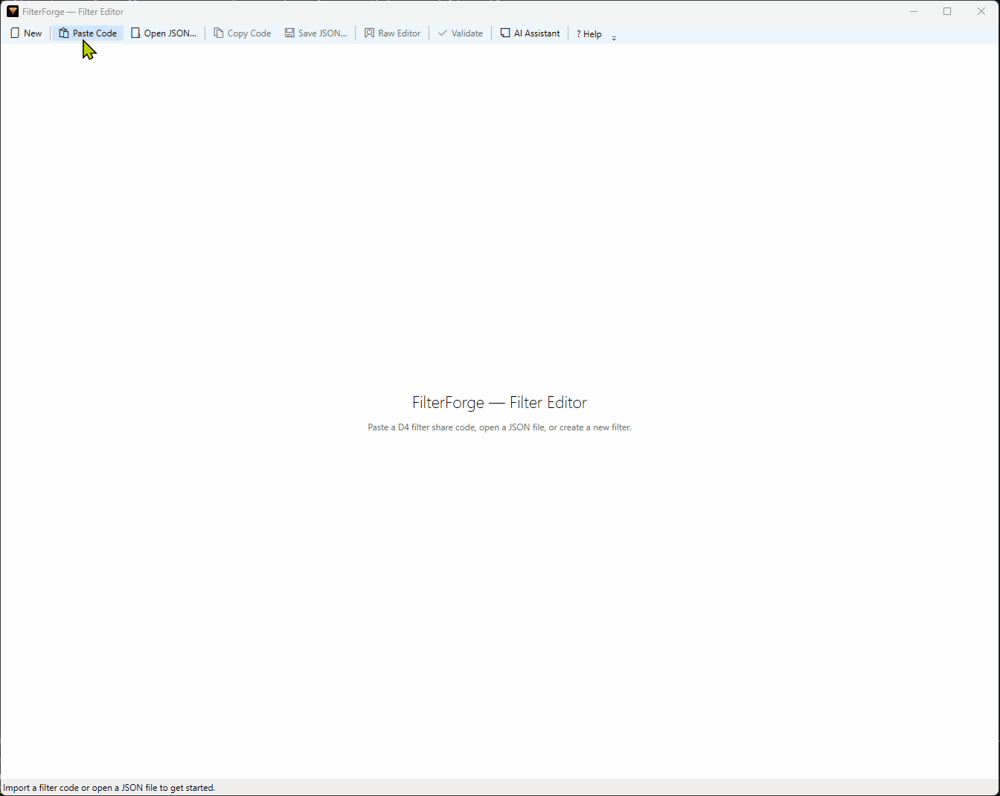

# D4LootBench

> A desktop editor for Diablo IV loot filter share codes — import, edit visually, export back to the game.

D4's in-game filter UI is functional but tedious for anything beyond the simplest rules. D4LootBench lets you import a share code, edit all its rules with a proper visual editor, and export a new share code to paste back into the game.



---

## Download

**[Download the latest release →](../../releases/latest)**

Single `.exe`, no installer, Windows only. Copy it anywhere and run it.

> **First run:** Windows SmartScreen may warn that the file is from an unknown publisher. This is expected for unsigned community tools — click **More info → Run anyway** to proceed.

---

## What It Does

- Import any D4 loot filter share code
- **Generate a BiS filter from a build guide** — paste a gear section from Mobalytics, Maxroll, or Icy Veins and get a working filter in seconds
- **Build a progression filter** — read your equipped gear from screenshots, diff it against a goal build, and generate a native filter that highlights only upgrades
- Add, remove, reorder, and edit rules with a full visual editor
- Edit all condition types: rarity, item power, affixes, greater affixes, codex of power, item types, unique items, talisman sets, and item properties
- Color-code rules with a full HSV color picker
- Export back to a share code to paste into D4
- Raw JSON editor for bulk edits and power users
- Optional AI assistant (Ollama) — describe a rule in plain English, get a filter rule back

---

## Usage

### Edit an existing filter

1. Open D4's in-game **Loot Filter** menu → select your filter → **Share** → copy the share code
2. Paste the code into D4LootBench
3. Edit rules and conditions in the visual editor (or switch to the Raw JSON editor)
4. Click **Copy Code** → paste back into D4's share code field

### Generate a BiS filter from a build guide

1. Open a build guide on **Mobalytics**, **Maxroll**, or **Icy Veins** and navigate to the gear / Best in Slot section
2. Select and copy the gear table (<kbd>Ctrl+C</kbd>)
3. Click **Import from Build Guide** in the D4LootBench toolbar
4. Paste the text, confirm the detected format, and click **Import Filter**
5. Tune the generated rules in the visual editor — by default each slot rule requires 2 of the 4 top affixes

### Build a progression filter

Highlights only gear that moves you toward a goal build — completed slots are dropped, and the freed rule budget is spent on stricter rules for the slots you still need.

1. Click **Progression…** in the toolbar
2. **Read gear** — screenshot each equipped item's tooltip in-game (<kbd>Win+Shift+S</kbd>, "Advanced Tooltip Information" ON) and click **Paste Screenshot**, or **Open Image…** for a saved file
3. **Review** — correct any misread slot / item power / rarity / affix, and tick greater affixes by hand (OCR can't detect them)
4. **Goal** — paste the gear section of a build guide, choose the format and how strictly an item must match to count as complete, then **Generate**
5. **Result** — **Copy Code** to paste into D4, or **Open in Editor** to fine-tune

> Full walkthrough, required settings, and the static-snapshot caveat: **[User Guide](docs/user-guide.md)**.

---

## AI Rule Assistant

The AI assistant is an opt-in feature — D4LootBench works fully without it.

**Recommended setup: [Ollama](https://ollama.com) (free, runs locally)**

1. Install Ollama from [ollama.com](https://ollama.com)
2. Pull a model (see table below): `ollama pull qwen2.5-coder:14b`
3. Open D4LootBench → click the **AI** button in the toolbar to expand the panel
4. Set **Base URL** to `http://localhost:11434` and **Model** to the name you pulled

Then describe what you want in plain English, e.g. *"show all ancestral items with a greater affix"*, and the assistant will generate a filter rule you can review before adding.

**Recommended models**

| GPU VRAM | Recommended model | Notes |
|----------|-------------------|-------|
| 10 GB+ | `qwen2.5-coder:14b` | Best quality; 11/11 on structured rule generation |
| 6–9 GB | `qwen2.5-coder:7b` | Good quality (11/11); fits most mid-range GPUs |

> If you're unsure how much VRAM your GPU has, check Task Manager → Performance → GPU. If a model is too large to fit in VRAM, Ollama will silently fall back to CPU — inference will work but will be significantly slower.

> **Other models:** Non-coding general-purpose models (e.g. `llama3.2`) are not recommended. The assistant output is structured JSON that must match a strict schema — general models tested poorly and produced incorrect rules even with precise prompts. Use a coder model if at all possible. If you choose to experiment with other models, review every generated rule carefully before adding it to your filter.

> Cloud providers (Anthropic, OpenAI) are not yet wired into the UI. The provider abstraction is in place and may be added based on community interest.

---

## Screenshot-OCR gear reader (Phase 1)

An experimental read pipeline that turns a screenshot of an equipped item's tooltip into a structured `GearItem` (slot, item power, rarity, ancestral flag, affixes). This is the first slice of the progression-filter roadmap; the full read → review → goal → generate flow is now wired into the **Progression…** toolbar button (see [Build a progression filter](#build-a-progression-filter) above).

**Requirements & constraints:**
- **English game client only**, with D4's **"Advanced Tooltip Information" set to ON**.
- The app **never touches the game process** — it only reads pixels from an image you provide (Win+Shift+S or a saved file). This is deliberate, to avoid any anti-cheat/ban risk.
- **Greater-affix markers are icons** that OCR cannot read, so they are **never parsed** — they are toggled by hand in the review step.
- OCR runs via in-box `Windows.Media.Ocr`; an English OCR language pack must be installed (Windows Settings → Language). No cloud calls.

**How it works:** `IGearReader` (in `D4LootBench.Vision`) isolates the WinRT OCR call — image → ordered text lines. `GearTooltipParser` (in `D4LootBench.Core`) then heuristically parses those lines into a `GearItem`, fuzzy-matching affix phrases against the catalog. Because Windows OCR exposes no per-word confidence, "low confidence" is a structural heuristic (missing power/slot/affixes or too few lines). A `GearReviewSession` lets a human confirm/correct fields and toggle greater-affix flags before the gear is used.

---

## Customizing Game Data

D4LootBench embeds a copy of `d4-data.json` — the database of affix names, item types, unique items, skills, and talisman sets used to populate the editor pickers.

To edit it (e.g. to add a newly released item or correct a name):

1. **File → Export d4-data.json** — writes the embedded file next to `D4LootBench.exe`
2. Edit the file with any text editor
3. Restart D4LootBench — the local copy takes precedence over the embedded one

See [docs/d4-data-format.md](docs/d4-data-format.md) for the full schema reference. Community corrections are welcome — see [CONTRIBUTING.md](CONTRIBUTING.md).

---

## Troubleshooting

**Filter code won't import / produces unexpected results**
Re-export the filter from D4's in-game UI instead of using a code shared externally. Codes shared via community sites or older tools may have subtle encoding differences from the current game version.

**AI assistant not responding**
Verify Ollama is running (`ollama list` in a terminal). Confirm the **Base URL** in the AI panel matches your Ollama port — the default is `http://localhost:11434`.

---

## Building from Source

Requires [.NET 10 SDK](https://dotnet.microsoft.com/download).

```powershell
dotnet build                    # build the full solution
dotnet test                     # run the test suite (102 tests)

# produce a self-contained single-file exe
dotnet publish src/D4LootBench.App -r win-x64 -p:PublishSingleFile=true --self-contained true
```

> Before tagging a release, walk the [release checklist](docs/release-checklist.md).

---

## Architecture

For those interested in the implementation:

- **Custom protobuf codec** (~80 lines, 3 wire types) — reverse-engineered from D4's binary share code format; no Google.Protobuf dependency, handles unknown fields gracefully for patch resilience
- **Clean multi-library solution** — `D4LootBench.Core` and `D4LootBench.Ai` (both zero WPF dependency), `D4LootBench.Vision` (isolated WinRT OCR reader), `D4LootBench.App` (WPF shell)
- **MVVM** with CommunityToolkit.Mvvm source generators and Microsoft.Extensions.DependencyInjection
- **`ILlmProvider` abstraction** over Ollama with clean extension points for additional providers
- **Annotated `{id, name}` JSON format** — human-readable and LLM-interpretable while keeping hash IDs (SNO IDs) authoritative
- **102 unit tests** covering codec round-trips, validation rules, annotated JSON serialization, build guide parser coverage across all three formats, and the screenshot-OCR gear parser / review session

See [docs/filter-format.md](docs/filter-format.md) for the full protocol buffer format specification.

---

## Attribution

D4LootBench was built on the shoulders of the following community reverse-engineering work:

| Project | License | Contribution |
|---------|---------|--------------|
| [Upsilon72/d4-filter-generator](https://github.com/Upsilon72/d4-filter-generator) | MIT | Protobuf wire format, condition type encoding, affix hash IDs |
| [fnuecke/diablo4-loot-filter-viewer](https://github.com/fnuecke/diablo4-loot-filter-viewer) | Unlicense | Complete `.proto` field layout, all 10 condition type semantics, `names.json` ID tables |
| [DiabloTools/d4data](https://github.com/DiabloTools/d4data) | MIT | `CoreTOC_flat.json` — authoritative datamined SNO IDs for skills, item types, affixes, and unique items |
| [d4lfteam/d4lf](https://github.com/d4lfteam/d4lf) | MIT | Affix name reference database |
| [Raxx (Raxxanterax)](https://github.com/raxxanterax/GAMING/blob/main/Raxxs%20Diablo%204%20T6%2B%20Endgame%20Filter.txt) | — | Real-world filter export used to validate and extend the format specification |

---

## License

MIT — see [LICENSE](LICENSE). Third-party notices: [THIRD-PARTY-NOTICES.md](THIRD-PARTY-NOTICES.md).

The original D4LootBench editor is © Scott Williams; the progression-filter fork and its additions are maintained by the fork contributors.

*D4LootBench is an unofficial community tool and is not affiliated with Blizzard Entertainment.*
